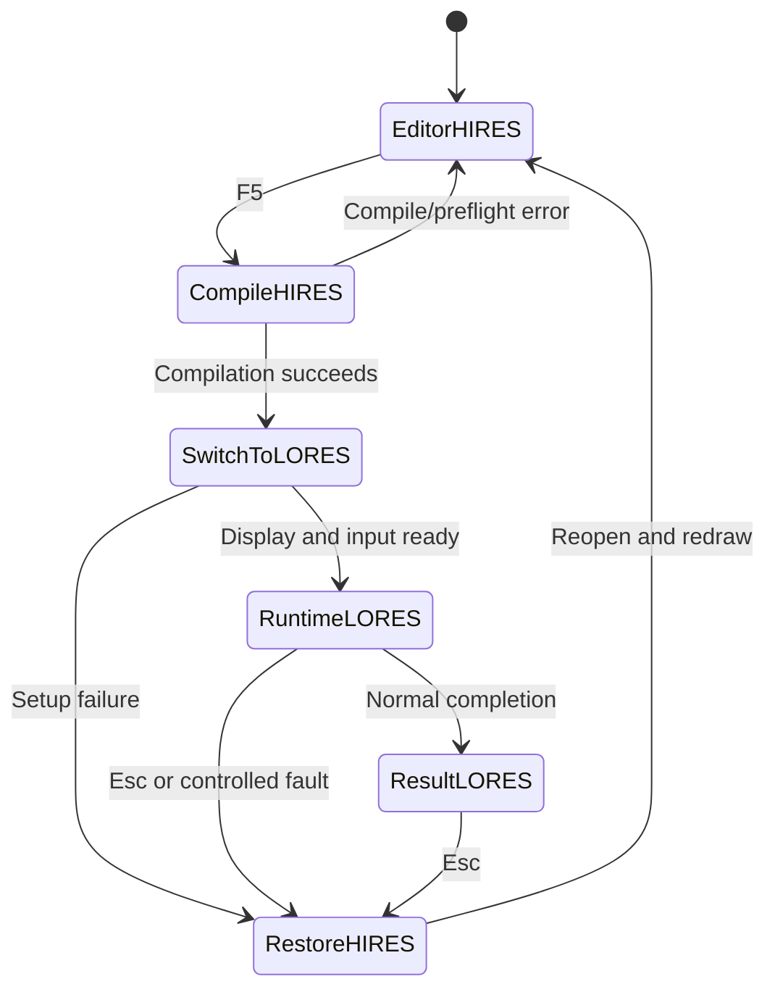

# MIGA-80 Source Editor — Feasibility and Token Budget

- **Date:** 2026-09-15
- **Status:** W1–W6 implemented on the existing 256 × 256 LORES display, including a two-plane direct-planar editor fast path and blitter-assisted one-row scrolling; W7–W10 remain proposals. No HIRES editor display or physical-hardware validation has been performed.
- **Repository baseline:** `61d9840`
- **Target:** PAL Amiga 1200, 68EC020, AGA, 2 MiB Chip RAM, no Fast RAM; the existing AmigaOS-hosted application.

## 1. Conclusion

The portable editor and hosted file-workflow milestone, ranks **W1 through
W6**, is now implemented within the current architecture:

- The fixed-capacity document supports insertion, deletion, cursor movement,
  vertical/horizontal scrolling and a 16 KiB source limit.
- Layout-aware text input, Shift+arrow selection, and the internal
  Ctrl+C/Ctrl+X/Ctrl+V clipboard are wired into the IDCMP loop.
- Transactional Load, Save and Save As are available, including dirty-document
  and overwrite confirmation. Loads accept tabs, normalize CRLF to LF, and are
  no longer limited by viewport rows or columns.
- The editable view currently uses the existing **256 × 256 LORES** screen and
  4 × 8 font. **No HIRES display work is included in this checkpoint.**
- The interactive source view writes directly to two of PF1's physical planes
  and redraws damaged rows only. A one-line vertical viewport change blits the
  retained 29 text rows and draws only the newly exposed row. It remains
  single-buffered; editor key handling does not wait for a vertical blank.

The remaining display/runtime proposal is still feasible:

- A **512 × 256 HIRES, four-colour editor** needs **32 KiB of planar display memory**.
- The existing **256 × 256 LORES runtime** uses eight bitplanes arranged as two four-plane playfields: **64 KiB per complete display buffer**.
- Two persistent 64 KiB Chip-RAM blocks can supply runtime double buffering. The editor can use the first 32 KiB of one block while the runtime is inactive. Text, cursor, selection and clipboard must live outside those blocks.
- Basic editing, Shift+arrow selection, keyboard clipboard commands, Load, Save and Save As require no compiler redesign or additional OS library beyond the current facilities.

The largest engineering cost is **changing display ownership and restoring the editor reliably**, especially during stopped animation or failed screen creation. Text operations are more contained. Reusing buffers is a credible design, but must first pass a small on-target prototype.

**Original planning estimate:** **75–132 thousand development tokens**, or approximately **95–165 thousand with a 25% contingency**, for the complete scope including shared video memory and integration tests. These are provisional effort estimates, not measured consumption or a billing quote. Section 3 retains the original complexity ranking; it is not a record of actual consumption.

This is a deliberately smaller editor milestone than the full [product roadmap](MIGA-80-specification-and-roadmap.md), which also requires undo/redo, search and other commands. It proposes HIRES for source editing as requested, revising the roadmap's initial 256 × 256 UI assumption. It does not complete the roadmap's hardware certification gates.

## 2. Existing foundations and required changes

The implementation was inspected directly; older documentation sometimes describes earlier checkpoints.

| Area | Current implementation | Consequence for the editor |
| --- | --- | --- |
| Source display | [source_view.c](../src/ui/source_view.c) and [source_view.h](../src/ui/source_view.h): editable, scrolling 256 × 256 LORES viewport with cursor and selection using the 4 × 8 font. Its interactive fast path renders directly into physical PF1 planes 2 and 6, producing the existing palette indices 0, 2, 8 and 10. Cursor motion redraws damaged text rows; a ±1-row vertical scroll uses the blitter with plane mask `0x44`, then draws the exposed row. | Replace only the display geometry/rendering layer for W7; document dimensions and dirty-region policy are already independent of the viewport. |
| Source loading | [demo/main.c](../src/demo/main.c): transactional 16 KiB source and staging buffers; CRLF normalization and encoding/capacity validation are independent of rendering. | Retain these semantics when later display work lands. |
| File selection | [file_picker.c](../src/demo/file_picker.c): directory navigation, pagination, keyboard and mouse actions, Save As filename entry and 512-byte path storage. | Adapt rendering and hit areas to HIRES only in W7. |
| Input | [editor.c](../src/ui/editor.c) and `demo/main.c`: layout-aware translated text, editing commands, Shift selection, internal clipboard, one-shot command filtering and repeatable editing actions. Translation occurs before replying to IDCMP messages. | Retain this portable command layer across later screen transitions. |
| Compile/run/stop | `demo/main.c` and [supervisor.c](../src/demo/supervisor.c): compile on a guarded stack, execute in a supervised task, stop with Esc. | Compile the live document and separate compile, display transition, execution and restoration. |
| Display | `demo/main.c`: one Intuition-owned eight-plane LORES screen for source, browser and result. The source editor deliberately touches only two PF1 planes after a full view restore; the browser and runtime retain their existing paths. | Introduce distinct HIRES editor and LORES runtime display configurations only if W7 is pursued. The existing two-plane editor does not require closing or reopening the screen. |
| Animation | [animation.c](../src/demo/animation.c): original screen plus two allocated animation buffers; assumes depth 8 and 32 bytes per row. | Convert to two borrowed runtime buffers, with explicit ownership and completion signals. |
| Drawing | [drawing_host.c](../src/demo/drawing_host.c): 64 KiB byte-per-pixel source supplied by the caller, 32 KiB planar storage and an 8 KiB triangle mask. | Keep runtime graphics semantics; include all these allocations in the budget. |

The compiler accepts a source pointer and length, but still has independent limits: 24 locals, 128 statements and 512 AST nodes in [frontend.h](../compiler/frontend/frontend.h), and a 4 KiB generated-code buffer in `demo/main.c`. Allowing a longer document does **not** mean every longer program will compile. Incomplete or invalid source must remain editable and saveable.

The current runtime remains hosted by AmigaOS. Switching resolution does not implement the future exclusive runtime, and `SA_Exclusive` on an Intuition screen is not exclusive ownership of scheduling and hardware.

## 3. Work ranked by complexity and token cost

### Implementation checkpoint

| Rank / ID | Current status |
| --- | --- |
| 1 / W1 | Implemented: layout-aware text decoding and command dispatch. |
| 2 / W2 | Implemented: bounded internal copy, transactional cut and paste. |
| 3 / W3 | Implemented: fixed-anchor Shift+arrow selection with LORES visual feedback and scrolling. |
| 4 / W4 | Implemented: staged 16 KiB load, encoding validation, CRLF normalization and dirty-document protection. |
| 5 / W5 | Implemented: Save, Save As, overwrite confirmation, checked publication through temporary/backup names, and recoverable failure reporting. |
| 6 / W6 | Implemented and host-tested: contiguous document model, insertion/deletion, cursor, preferred column and scrolling. |
| 7 / W7 | Deferred: no HIRES screen or HIRES-specific renderer in this checkpoint. The implemented four-colour planar fast path remains LORES. |
| 8–10 / W8–W10 | Deferred except for focused W1–W6 integration coverage inside the existing release/browser regression. |

### Estimation convention

Here, **1 kt = 1,000 development tokens**: cumulative model input and output used to inspect relevant code, implement a bounded work package, inspect test results and fix ordinary failures. Repeated context counts again. This is neither the number of tokens in the resulting code nor MIGA Lua lexer tokens.

Assumptions: one developer assisted by a coding agent, reuse of this repository's toolchain, a 16 KiB single-document limit, internal clipboard, existing compiler/runtime semantics, and no advanced editor features. No measured productivity baseline exists; model choice, context reuse and hardware debugging can move the estimates substantially. Physical test sessions and hardware access are not expressible reliably as token costs.

The rows are **incremental**: a feature's estimate assumes its listed dependencies already exist. Each includes focused validation; W8 covers only the additional cross-component and release work. The order is a complexity ranking, not the implementation sequence.

| Rank / ID | Work package | Complexity | Estimate | Dependencies | Main source of effort |
| --- | --- | --- | ---: | --- | --- |
| 1 / W1 | Keyboard decoding and command dispatch | Low | 3–6 kt | Existing IDCMP loop | Layout-aware text, qualifiers, repeats and message lifetime. |
| 2 / W2 | Ctrl+C / Ctrl+X / Ctrl+V, internal clipboard | Low | 3–6 kt | W6, W3, W1 | Bounded multiline copy and transactional cut/paste. |
| 3 / W3 | Shift+arrow selection | Low–medium | 4–7 kt | W6, W1; W7 for visual integration | Stable anchor, reversed ranges, scrolling and replacement. |
| 4 / W4 | Load into an editable document | Low–medium | 4–8 kt | W6, W7 | Existing browser adaptation, staging, encoding and dirty-document handling. |
| 5 / W5 | Save and Save As | Medium | 7–12 kt | W6, W1, W4 | Filename/path UI, overwrite, checked writes and recoverable replacement. |
| 6 / W6 | Document model, insertion/deletion, cursor and scrolling | Medium | 8–14 kt | None for portable core | Newline boundaries, preferred column, capacity and document/view separation. |
| 7 / W7 | HIRES four-colour screen and text renderer | Medium–high | 9–15 kt | W6 for editor integration | Font, planar rendering, viewport geometry, cursor, palette and browser layout. |
| 8 / W8 | Workflow, failure and release integration tests | High | 10–18 kt | Other packages | Real keyboard input, repeated run/stop, disk errors and memory accounting. |
| 9 / W9 | HIRES → LORES → HIRES lifecycle | High | 12–20 kt | W6, W7; existing supervisor | Split compile/run, rebuild windows, preserve state and unwind failures. |
| 10 / W10 | Shared Chip-RAM buffers and animation ownership | Highest | 15–26 kt | W9; existing animation/drawing | Caller-owned bitmaps, DMA lifetime, removal of the third buffer, failure recovery. |
| **Total** | **Complete requested milestone** | | **75–132 kt** | | **Approximately 95–165 kt with contingency.** |

If the sharing prototype fails, the same editor commands remain feasible with separate persistent video buffers. This removes only the aliasing-specific part of W10: W9 and the two-buffer animation refactor are still needed for the 264 KiB fallback described below. Re-estimate that reduced package after the prototype instead of subtracting all of W10. The fallback still reduces repeated video allocations, but consumes more memory and does not achieve editor/runtime aliasing.

## 4. Planned HIRES display and text layout (W7, not implemented)

### Mode and geometry

Use an Intuition custom screen with `PAL_MONITOR_ID | HIRES_KEY`, depth 2, width 512 and height 256, without interlace or dual playfield. Keep the runtime at its current `PAL_MONITOR_ID | LORESDPF_KEY`, 256 × 256, depth 8. Use separate palette and screen/window setup functions for these two configurations.

The requested 512-pixel width is a custom visible region within a PAL HIRES mode; the mode's usual nominal width is 640. Verify screen dimensions, centring and clipping explicitly instead of assuming that a mode ID defines the requested rectangle. Intuition provides `SA_Width`, `SA_Height`, position and display-clip controls. See the [OpenScreen autodoc](https://developer.amigaos3.net/autodocs/intuition.library/OpenScreen.html).

Recommended first layout:

| Element | Proposal |
| --- | --- |
| Font | Monospaced 6 × 8 cell, including spacing; validate readability on a real display. |
| Grid | 85 columns × 32 rows, with 2 horizontal pixels unused. |
| Header / footer | One row each: filename and modified marker; commands and line/column. |
| Source viewport | 30 rows; 80 source columns plus a five-cell line-number/separator area. |
| Long lines/files | Horizontal and vertical scrolling; no soft wrapping in this milestone. |
| Four colours | Background, normal text, selection background, accent/cursor; selected text reuses a contrasting existing colour. |

The current 4 × 8 font could provide 128 columns in HIRES, but that density needs a readability check. An 8 × 8 font gives 64 columns. The 6 × 8 option is a proposed usability compromise, not a user requirement or a measured optimum.

### Rendering strategy

Render glyphs and backgrounds directly into the two editor bitplanes. A byte-per-pixel HIRES staging image would cost another **128 KiB**; it is unnecessary for a small text UI. The existing Kalms `colour4` path produces **four bitplanes / 16 colour indices**, so it cannot simply be pointed at two editor planes.

Start with clipped CPU glyph writes and dirty text rows. A full eight-pixel-high row across both editor planes contains only `64 × 8 × 2 = 1,024` bytes. Repaint old and new cursor cells, affected selection rows and exposed text after scrolling. Rebuild the viewport after a mode transition. Any concurrent blitter operation must finish before CPU writes touch its destination.

A single editor bitmap is the initial choice. Synchronize/coalesce redraws where useful, but measure tearing and input latency: one vertical-blank wait does not prove that a redraw finishes before display DMA reaches it. If necessary, a second editor image can use the other half of the same 64 KiB block, without increasing the video reservation; its extra synchronization is follow-up scope.

The file browser and Save As view should use the HIRES renderer and geometry. Mouse operation in the existing file browser can remain available. Mouse-based source selection, copy, cut and paste are outside this milestone.

## 5. Video memory reuse

### Exact payload arithmetic

For these widths, a standard non-interleaved plane has no 16-pixel row-padding overhead:

```text
bytes_per_row = 2 × ceil(width / 16)
bitmap_bytes = bytes_per_row × height × depth

HIRES editor:   64 × 256 × 2 = 32,768 bytes = 32 KiB
LORES layer:    32 × 256 × 4 = 32,768 bytes = 32 KiB
LORES screen:   32 × 256 × 8 = 65,536 bytes = 64 KiB
Runtime pair:  2 × 65,536    = 131,072 bytes = 128 KiB
```

The editor equals **one runtime playfield's payload**, not the complete dual-playfield screen. These figures exclude alignment, descriptors, Copper lists, sprite pointer data and OS allocations; validate the actual bitmap stride before using them.

### Proposed persistent layout

Reserve two separately allocated, suitably aligned 64 KiB `MEMF_CHIP` blocks early in startup. This avoids requiring one contiguous 128 KiB allocation and follows the roadmap's preference for smaller explicit pools. Keep each allocation's original base and size for final release.

| Block | Editor active | Runtime active |
| --- | --- | --- |
| A: 64 KiB | Plane 0: offset 0, length 16 KiB. Plane 1: offset 16 KiB, length 16 KiB. Remaining 32 KiB reserved. | Eight planes, each 8 KiB, at offsets `plane × 8 KiB`. |
| B: 64 KiB | Reserved for runtime; no live editor dependency. | Second complete eight-plane display buffer. |
| CPU document storage | Text, cursor, anchor, scroll, clipboard, filename and dirty state. | Preserved throughout execution. |

Create separate bitmap descriptors: editor stride 64/depth 2, runtime stride 32/depth 8. Different descriptors may describe the same bytes **at different times**. Two unrelated 8 KiB plane allocations cannot be treated as one contiguous 16 KiB HIRES plane; this layout requires ownership of the underlying blocks.

Intuition accepts caller-supplied display storage through `SA_BitMap`. On a custom-bitmap screen, `AllocScreenBuffer` can wrap a supplied matching bitmap. This supports the proposed ownership model; the actual aliasing and reopen sequence remain to be proven on the target. See [OpenScreen](https://developer.amigaos3.net/autodocs/intuition.library/OpenScreen.html) and [AllocScreenBuffer](https://developer.amigaos3.net/autodocs/intuition.library/AllocScreenBuffer.html).

Only the display-memory owner releases A and B. Screen and animation objects borrow descriptors/storage. Audit custom-bitmap cleanup on the supported ROM so that neither a library cleanup path nor the old drawing code frees borrowed plane memory.

### Current and proposed graphics allocations

| Payload | Current animated run | Proposed shared layout |
| --- | ---: | ---: |
| Original screen plus animation bitmaps | 64 + 128 = 192 KiB | 128 KiB total |
| Runtime byte-per-pixel source | 64 KiB | 64 KiB |
| Drawing planar storage | 32 KiB | 32 KiB |
| Triangle mask | 8 KiB | 8 KiB |
| **Graphics payload subtotal** | **296 KiB** | **232 KiB** |

The proposed **64 KiB saving** assumes that animation really becomes a two-buffer owner and no extra original/result screen is retained. Of that saving, 32 KiB comes from reducing the original 64 KiB LORES editor image to HIRES/depth 2, and 32 KiB comes from sharing the HIRES image's storage. Separate persistent HIRES storage plus two runtime buffers would total **264 KiB**, including the same drawing buffers.

These are source-derived payload totals, not measured whole-application peaks. In particular:

- The 232 KiB subtotal already exceeds the roadmap's original **192 KiB graphics envelope**. Update that envelope or separately optimize runtime scratch/source storage before claiming compliance.
- Code, compiler structures and stacks, OS screens, browser entries, loaded MOD data and Paula sample copies are additional consumers.
- CPU-only allocations may use Fast RAM when available, but consume Chip RAM on the required stock machine. `MEMF_PUBLIC` does not mean Fast RAM.
- Persistent runtime blocks increase idle-editor residency. That trades some free idle memory for predictable run transitions.

Keep the existing 32 KiB planar store and 8 KiB mask separately owned for this milestone; preferably reserve these fixed buffers once as well. Eliminating them is a separate runtime optimization. Do not overlap them with an active display, source text or live audio samples.

### What this solves, and what remains

Fixed reservations stop repeated allocation/free of the large video payloads. They cannot guarantee a fragmentation-free application: opening screens still allocates OS control structures, and the compiler, file picker and music loader have other allocation lifetimes.

Record Chip-RAM total free space, largest free block, allocation counts and peak usage at startup, editor idle, compile, runtime and restored editor. Keep the pixel-block addresses stable across repeated runs. If shared storage is unreliable, use the separate persistent 32 KiB editor bitmap as the first fallback and report its cost explicitly.

## 6. Compile, switch mode, run and restore

Do not mutate the dimensions or depth of a live Intuition bitmap to change resolution. `ChangeScreenBuffer` swaps a screen's bitmap; its companion allocation API expects matching properties. Use it for runtime frame swaps, and reopen/reconfigure the hosted screen for the resolution transition. See [ChangeScreenBuffer](https://developer.amigaos3.net/autodocs/intuition.library/ChangeScreenBuffer.html).



1. **Compile the current in-memory text while HIRES remains visible.** Use document length and freshly derived metrics. F5 does not save automatically. Syntax errors stay in the editor; the source, selection and dirty state survive. Keep the existing guarded compiler-stack and cache synchronization protocol.
2. **Preflight runtime needs.** Prepare code, stack, drawing resources and required music data. Source and clipboard stay allocated. Refactor `compile_and_run_on_current_stack`, which currently combines compilation, source redraw and execution around a single screen pointer.
3. **Quiesce the editor and retire its display.** Stop rendering, handle pending input, close its window and then its screen, and check closure success. Only after the old screen can no longer fetch from A may runtime initialization overwrite A. Intuition refuses closure with open windows or outstanding locks; see [CloseScreen](https://developer.amigaos3.net/autodocs/intuition.library/CloseScreen.html).
4. **Open LORES using A/B and rebind input.** Install the existing dual-playfield palette/Copper configuration. Recreate the window and replace `active_window` and related event-port/supervisor references before starting the worker. Held F5 or Esc must not leak into a second command after a transition.
5. **Run with two display buffers.** Preserve the existing safe/displayed message protocol. The current `animation_destroy` restores buffer 0 on the same screen; that assumption must disappear. Handle nonanimated demos and final-result publication through the same display owner.
6. **Stop and restore in ownership order.** Stop/remove or join the generated worker, stop audio, finish blits, and drain outstanding buffer replies. Free screen-buffer wrappers before closing the runtime screen; retain the caller-owned pixel blocks. Explicit `WaitBlit` is needed on the supported V39 path; see [FreeScreenBuffer](https://developer.amigaos3.net/autodocs/intuition.library/FreeScreenBuffer.html).
7. **Reopen HIRES and redraw from text.** Restore cursor, selection, preferred column, viewport, path and modified state. Normal completion may keep the result in LORES until Esc, preserving today's workflow. Controlled runtime errors return to HIRES with diagnostics.

One cleanup path must cover partial startup, compile failure, allocation failure, Esc, runtime faults and quit. If opening LORES fails, restore HIRES without losing the document. If HIRES restoration also fails, keep the document resident and provide retry or an AmigaDOS save/recovery path; do not exit and discard unsaved text.

Closing the last custom screen can cause Intuition to reopen Workbench. Measure this on both the minimal boot disk and a Workbench launch; a brief transition and OS allocation overhead are acceptable initial outcomes. Seamless transitions are not assumed.

## 7. Minimum editor behaviour

### Document model

Use a **fixed-capacity contiguous text buffer** for the first version, provisionally 16 KiB plus a terminator. This is a proposed bounded milestone, not the final cartridge source limit. At that size, `memmove` insertion/deletion is simpler than a rope or piece table and moves at most 16 KiB per operation. Measure responsiveness on the stock CPU before increasing capacity or adopting a gap buffer.

Store byte length, cursor offset, selection anchor, preferred visual column, first visible line/column, filename and dirty flag independently of pixels. A small current-line cache and bounded scans are sufficient initially; avoid per-line heap allocations and nested whole-document rescans on every keystroke. An empty document has one editable line, and the cursor can sit after a final LF.

Allocate a separate load staging buffer of the same capacity and a 16 KiB clipboard. These three payloads total **48 KiB plus terminators and metadata**, outside the video blocks. Do not merge the clipboard with staging: opening a file must not overwrite copied text.

Use printable ASCII, LF and tabs; canonicalize CRLF on load. Preserve tab bytes, display them at four-column tab stops, and make newly typed Tab insert spaces to the next stop. Save with LF. Reject unsupported bytes with a clear message before committing a load. This keeps source encoding explicit while supporting normal indentation.

### Commands and selection

| Input | Required behaviour |
| --- | --- |
| Printable text / Enter | Insert text or LF at the cursor; replace a selection as one edit. |
| Backspace / Delete | Remove the selection, otherwise the previous/next character; join lines when deleting LF. |
| Left / Right | Move one character, crossing line boundaries. |
| Up / Down | Move one logical line and preserve the preferred visual column; clamp on shorter lines. |
| Shift + arrows | Extend/reduce a range from a fixed anchor, including across lines and outside the viewport. |
| Ctrl+C | Copy selected bytes; no selection means no action. |
| Ctrl+X | Copy selected bytes successfully, then delete them. |
| Ctrl+V | Insert clipboard bytes or replace the selection. |
| Ctrl+O / Open | Load source through the existing browser. |
| Ctrl+S | Save to the current filename, or open Save As if unnamed. |
| Shift+Ctrl+S | Save As: choose directory, enter filename and confirm replacement if needed. |
| F5 / Esc | Compile/run; stop or return from the result. Esc in a dialog cancels it. |
| Ctrl+Q | Quit, with modified-document handling. |

Use a half-open selected range `[min(anchor, cursor), max(anchor, cursor))`. Reversing direction must not reset the anchor. Without Shift, Left/Right collapse selection to its start/end; Up/Down clear selection and move from the active end. Scrolling always keeps the active cursor visible. These rules also allow deleting entire lines by selecting their text and newline.

Capacity checks happen **before** destructive edits: for replacement, check `length - selected_length + inserted_length`. A failed paste preserves text, selection, cursor, clipboard and dirty state. Clipboard contents survive F5/Esc and file loads; system-wide Amiga clipboard interoperability is deferred.

Map text through the current AmigaOS keymap, including Shift/Alt-produced ASCII punctuation used by code. Raw keys remain appropriate for arrows and function keys. Decode Ctrl commands before filtering printable text, and normalize the shortcut's Shift qualifier when distinguishing Ctrl+S from Shift+Ctrl+S. Handle both Shift keys and separate repeatable movement/deletion from one-shot load/run/save actions.

The present loop copies message fields before `ReplyMsg`; text input also needs the dead-key information referenced by `IAddress`. Translate while the message remains valid, or copy all needed data before replying. `MapRawKey` may return multiple bytes or an overflow error; insert valid text atomically. See the [MapRawKey autodoc](https://developer.amigaos3.net/autodocs/keymap.library/MapRawKey.html).

Undo/redo, search, syntax highlighting, completion, multiple files, mouse text selection, OS clipboard exchange and extra navigation commands are deferred. Their absence must be clear in the milestone description; they are not hidden requirements in the token estimate.

## 8. Load, Save and Save As

**Load:** keep the browser's staging-and-commit approach. Read to EOF with an explicit capacity check, normalize/validate text, then replace document contents and path together. Empty files are valid. Reject oversized files, I/O errors or unsupported encoding without losing the previous document. The viewport's 30 rows and 80 columns impose no source-size restrictions.

**Modified documents:** show Save / Discard / Cancel before replacing an edited document or quitting. A failed or cancelled Save cancels the destructive action. Cancelling a browser or Save As dialog preserves the prior path, cursor and dirty state. These are application behaviours needed to protect edited text, not an approval requirement for conducting this study.

**Save:** serialize the live document, check every write and the final close, and clear dirty state only after successful publication. **Save As** adds a bounded directory/filename entry field and updates the current path only after success. Keep the existing 511-byte usable path limit; separately validate filename-component limits for the target OFS/FFS filesystem. Avoid silent truncation and collisions in both user filenames and temporary names.

For replacing an existing file, use this bounded recovery protocol:

1. Write a uniquely named temporary file in the destination directory and check completion/close.
2. Move the existing destination to an unused backup name in that directory.
3. Rename the completed temporary file to the destination.
4. If publication fails, attempt to restore the backup and report any surviving recovery files. Remove the backup after successful publication; report cleanup failure separately from successful saving.

AmigaDOS `Rename` fails if the destination exists and cannot move a file across volumes; its autodoc also documents filename truncation risks. The protocol therefore cannot assume POSIX replacement semantics. See [Rename](https://developer.amigaos3.net/autodocs/dos.library/Rename.html).

This is recoverable replacement, **not a power-loss-atomic transaction**. Disk-full, write-protection, media removal, rename failure and backup-name conflicts must leave either the old file or a clearly identified recovery copy. Preserve the in-memory document and dirty state on save failure. Temporary and backup files must never overwrite unrelated files.

File operations remain in hosted mode. The boot disk may be full or write-protected, so Save As must permit a writable project disk or directory. Saving to `RAM:` is useful for testing but is volatile. No additional ASL dependency is necessary for the initial custom filename field.

## 9. Recommended implementation order and validation

### Delivery sequence

1. **Resolve the largest uncertainty first — slices of W7, W9 and W10.** Create a small HIRES/LORES prototype with two caller-owned blocks, distinct descriptors, a static text pattern and a runtime pattern. Repeatedly switch, close and reopen; inject screen-allocation failures. Treat this work as part of those packages, not an extra estimate. Retain the separate-buffer fallback until sharing is proven.
2. **Build the portable editor — W6 and W1.** Establish text/cursor semantics, bounded storage, layout-aware commands and document tests. No display-dependent text validation.
3. **Make editing visible — finish W7, then W3 and W2.** Add HIRES rendering, scrolling, cursor, Shift selection and keyboard clipboard. Check the font on a real display early.
4. **Make documents persistent — W4 and W5.** Adapt the browser, add Save/Save As and modified-document handling. Test failure paths before using valuable files.
5. **Integrate execution — finish W9 and W10.** Compile unsaved text, use the two-buffer runtime, preserve the LORES result view, restore HIRES on Esc/fault and adapt the boot intro's existing animation use.
6. **Validate the complete workflow — W8.** Extend emulator/release regressions and perform stock-A1200 checks. Update the roadmap and user instructions when the implementation lands.

### Implemented W1–W6 validation

`gmake editor-test source-view-test miga80-demo` exercises the portable editor
under address/undefined-behaviour sanitizers, the scrolling LORES renderer, and
the warnings-as-errors Amiga cross-build. `gmake release-fs-uae` additionally
boots the reference ADF and covers long-line/many-row loading, Shift selection,
internal copy/cut/paste, Save As to `RAM:`, overwrite confirmation,
dirty-document cancellation, Save-before-quit, native execution and cleanup.
The reference ADF remains LORES throughout.

### Acceptance evidence

| Area | Required evidence |
| --- | --- |
| Portable editing | Empty document; first/last byte; trailing LF; line split/join; tabs; long lines; preferred-column movement; selection reversal; multiline cut/paste; capacity failure without mutation. |
| HIRES rendering | Exact 512 × 256/depth-2 descriptor, four-colour output, planar readback, clipped glyphs, scrolling, selection and cursor redraw; no 128 KiB chunky editor image. |
| Native input | Real `input.device` → IDCMP typing and Shift+arrows; Ctrl+C/X/V/S; French and US layouts; key releases, repeat and stale events across screen transitions. |
| Compiler integration | Edit a known demo without saving; F5 executes that edited version. Compile errors preserve editable text; existing compiler limits produce diagnostics. |
| Mode restoration | Actual HIRES editor and LORES runtime readbacks, repeated success/Esc/fault cycles, same text/cursor/selection/scroll/clipboard afterward; static and animated demos, music and intro. |
| Memory ownership | Stable A/B addresses; guards intact; no writes after retirement; both buffer replies drained; no payload allocation on each F5; warm total/largest-free-block measurements. |
| File I/O | Empty and multiline round trips; CRLF/tab handling; Save As path commit; overwrite cancellation; full/protected/missing disk; partial write/close/rename failure; recovery files. |
| Whole application | Bootable OFS image and Workbench/CLI launch, 2 MiB Chip/no Fast; actual peak RAM and ADF footprint; clean shutdown and recovery after failed display setup. |

Reuse the existing host/source-view and FS-UAE infrastructure, including `gmake source-view-test`, `gmake miga80-demo-adf-fs-uae-workflow`, `gmake miga80-demo-adf-fs-uae-stop` and `gmake release-fs-uae`, adapting source-view goldens only when the intended display changes. Preserve runtime graphics/compiler oracles. Add focused editor tests and run the relevant broader checks after integration.

FS-UAE can establish correctness and repeatability. Font comfort, redraw latency, mode-transition appearance, floppy behaviour and sustained memory headroom require physical A1200 validation. A reasonable initial soak is 100 warm run/stop cycles plus repeated load/save cycles, with no unexplained growth in live allocations or persistent loss of the largest free block.

**Go/no-go:** proceed with shared storage once custom-bitmap ownership, two-buffer animation and failure restoration pass the prototype. The rest of the editor can use the same document/input design with either storage policy. Re-estimate the remaining work after that prototype using observed token consumption and measured memory, rather than treating the initial ranges as fixed commitments.
